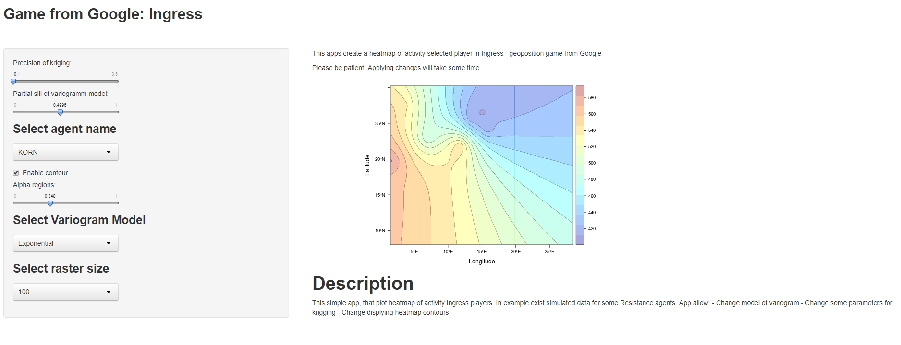

Reproducible Pitch Presentation
========================================================
author: Ariel
date: July 20, 2018
autosize: true

Course Project
========================================================

Please check out the Course Project <https://capsula.shinyapps.io/Ingress/>.

Overview
========================================================
It's Shiny app creates a heatmap of activity selected player in [Ingress](https://www.ingress.com/) - geoposition game from Google.

This simple app, that plot heatmap of activity Ingress players.

In example exist simulated data for some Resistance agents.

App allow:
- Change model of variogram
- Change some parameters for krigging
- Change displying heatmap contours


Common view of app
========================================================



Thank you for attention!
========================================================
Actually, just to done this requirement:

***It must contained some embedded R code that gets run when slidifying the document***


```r
Sys.time()
```

```
[1] "2018-07-20 11:52:40 EET"
```
